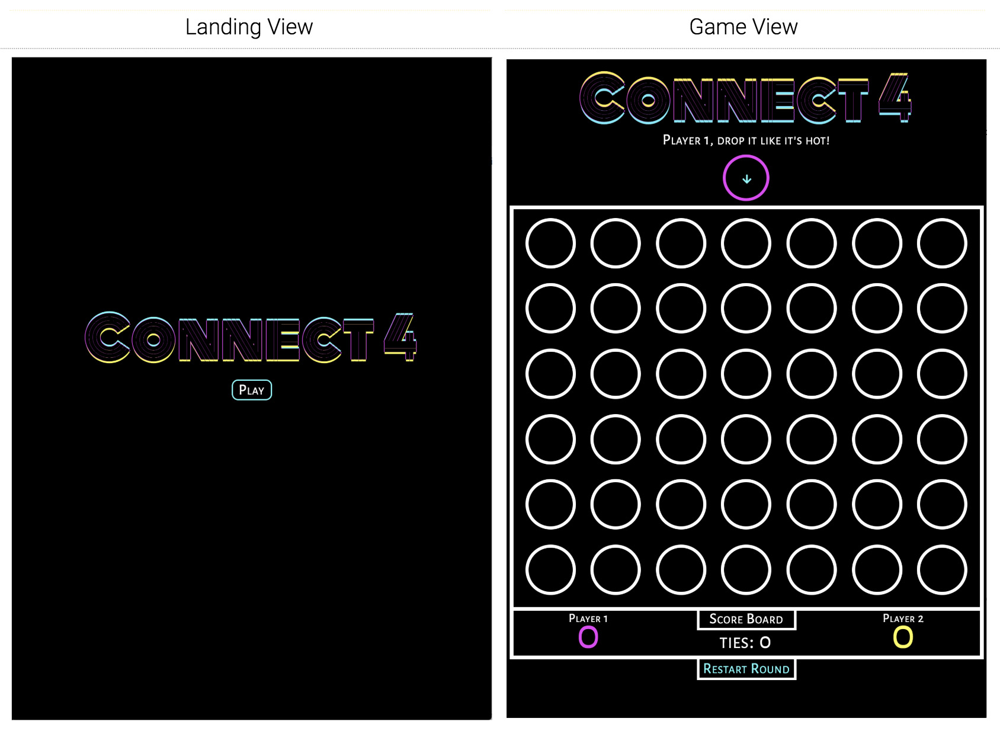

# Connect Four

  <a href="https://pages.git.generalassemb.ly/simon/project-1-connect-4/">Live</a> |
  <a href="https://docs.google.com/document/d/10w_D423QGXMzwPaOHB7J-cMXR3JBZQbwN6R7mkRZ0c0/edit?usp=sharing">Proposal</a> |
  <a href="https://docs.google.com/presentation/d/1LLGQuup_bryUyTQuZBreQGIwf_3NLnqrKmt0FKySUzo/edit?usp=sharing">Slides</a>
   
  

Connect Four is a two-player connection game in which the players first choose a color and then take turns dropping colored discs from the top into a seven-column, six-row vertically suspended grid. The pieces fall straight down, occupying the next available space within the column. The objective of the game is to be the first to form a horizontal, vertical, or diagonal line of four of one's own discs.  [*Paraphrased from Wikipedia*]

## Transition: Landing View → Game View

The CONNECT 4 title enters the page by a sliding animation to center page, then a start button fades in directly below. The start button must be clicked in order to access the game view. Once clicked, the button disappears and the title slides up. A game board appears.

## Features
As the game board appears, above it is a message prompt (informing on who’s turn it is). Below, a scoreboard also appears along with a button to restart the round. The game view repeats itself with each round, as the scoreboard is continually updated.
For now this is a one-on-one turn-based game. Each player takes a turn by clicking a column on the board with an empty space. The first player to make a connection of 4 (or greater) scores a point, then the players get to play another round.

## Responsive Design
* Maximum display resolution (760px width, 987px height)
* Medium display resolution (580px < width < 760px, 780px < height < 987px)
* Minimal display resolution (360px < width < 580px, 640px < height < 780px)

## Major Phases
1. Phase 1: Layout of Container Grid (Preview Row + Game Board)
2. Phase 2: Board Display + Logic + Functionality
3. Phase 3: Game Play Logic for 1-on-1
4. Phase 4: Animate Landing Page, Transition Into Game View

## Constraints
At the time this project was created, my understanding of CSS + JavaScript was still quite fresh. I intend to refactor this code with Vanilla JS, and hopefully some type of AI.

## Next Steps
 * refactor with Vanilla JS
 * implement ai + a menu with option to play 1-1 or 1-ai
 * implement click & hover functionality on preview row
 * implement keyboard functionality to drop pieces
 * add button for hint (to suggest a move based on ai)
 * add button for instructions on how to play
 * add button to undo last move(s)
 * improve buttons below game board
 * improve win or tie declaration, animate a modal pop-up
 * toggle starting player and color per round
 * restructure scoring system
   * add bonus for connections of more than 4
   * add bonus for amount of remaining pieces post-win
 * add more sound effects
 * eventually add network functionality to play 1-1 remotely
